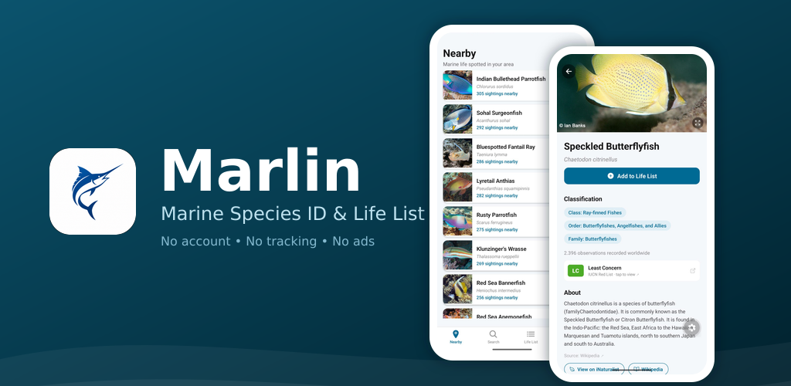

# Marlin Ocean ID Mobile App



Marlin is a marine species identification and life-list app for fish and marine life. Spot something while diving or beachcombing, look it up, and log it to your personal life list with a photo, notes, and a pinned location.

Android-first (iOS to follow), built with Expo + React Native.

## Features

- **Nearby** — species commonly recorded near your current (or a manually chosen) location, powered by iNaturalist observation data
- **Search** — look up any marine species by name, or browse by classification (tap a chip like "Family: Requiem sharks" to explore relatives), optionally narrowed to species seen near you
- **Species detail** — photos, range map, seasonality chart, Wikipedia summary, IUCN Red List conservation status, and recent sightings from the iNaturalist community
- **Life List** — your personal record of every species you've logged, with swipe-to-delete
- **My Map** — every sighting you've logged, pinned on a map and color-coded by taxonomic group (fish, sharks & rays, mollusks, jellyfish, marine mammals, …)
- **Sightings** — attach notes, photos, and a tap-to-place location to each logged sighting; edit or delete any time
- **Settings** — light/dark/system theme, manual export/import of your life list, and a manual location override (handy for logging a dive trip after the fact)

No account or sign-up required — everything lives on your device, with manual export/import for safekeeping.

## Tech stack

- [Expo SDK 56](https://docs.expo.dev/versions/v56.0.0/) + React Native + TypeScript
- [Expo Router](https://docs.expo.dev/router/introduction/) for file-based navigation
- [iNaturalist API](https://api.inaturalist.org/v1/docs/) for species data, photos, and observations, plus optional [IUCN Red List](https://api.iucnredlist.org/) conservation status
- [TanStack Query](https://tanstack.com/query/latest) for remote data fetching/caching
- [expo-sqlite](https://docs.expo.dev/versions/v56.0.0/sdk/sqlite/) for the on-device life list, and [Zustand](https://zustand-demo.pmnd.rs/) for app state
- [Leaflet](https://leafletjs.com/) (via WebView/iframe + OpenStreetMap tiles) for all maps — no Google Maps API key needed

See [CLAUDE.md](./CLAUDE.md) for a deeper tour of the source layout and the patterns used throughout (platform-specific files, map communication, Zustand selector rules, photo storage, etc.).

## Getting started

### Prerequisites

- **Node.js v22+** (Metro fails to start on v21 — it depends on `util.styleText` array support)
- A physical Android device or emulator for native testing (maps and several native modules need a dev build — see below)

### Setup

```bash
nvm use 22
npm install
```

Optionally copy `.env.example` to `.env.local` and add a free [IUCN Red List API token](https://api.iucnredlist.org) to enable conservation-status badges on species pages. The app works fine without one — it just falls back to lower-coverage iNaturalist data for that one feature.

### Running the app

```bash
npx expo start          # Metro bundler — open in a web browser or Expo Go
npx expo run:android    # build & run a native dev client on Android (recommended)
npx expo run:ios        # build & run a native dev client on iOS
```

Use `npx expo start --clear` to bust the Metro cache after pulling changes that touch platform-specific (`.web.ts`/`.web.tsx`) files.

> The project ships with `expo-dev-client` and several native modules — including a custom GMS-free location module on Android (see [CLAUDE.md](./CLAUDE.md)) — so `expo run:android`/`expo run:ios`, which build a custom dev client, is **required** to run the app on Android; Expo Go can no longer load it (it lacks that custom native module). iOS and web still run fine in Expo Go / a browser.

## Project structure

```
src/
  api/          iNaturalist (and Wikipedia / IUCN) API clients
  app/          Expo Router screens — tabs, species detail, sighting detail (file-based routing)
  components/   Maps, photo viewer, and shared UI primitives
  db/           SQLite singleton, sighting CRUD, key/value settings
  hooks/        Location, search, and nearby-species data hooks
  lib/          Photo storage, plus platform-split location/geocoding helpers (GMS-free on Android)
  store/        Zustand stores — life list, theme, manual location override
  types/        Shared TypeScript types
```

See [CLAUDE.md](./CLAUDE.md) for the full annotated layout.

## Scripts

| Command | What it does |
|---|---|
| `npm start` | Start the Metro bundler |
| `npm run android` / `npm run ios` | Build and run a native dev client |
| `npm run web` | Run the web build |
| `npm run lint` | Lint with `expo lint` |
| `npm run reset-project` | Move the starter code aside and start from a blank `app/` directory |

## License

MIT — see [LICENSE](./LICENSE). Bundled third-party code (Leaflet) is under its own license — see [NOTICE](./NOTICE).
